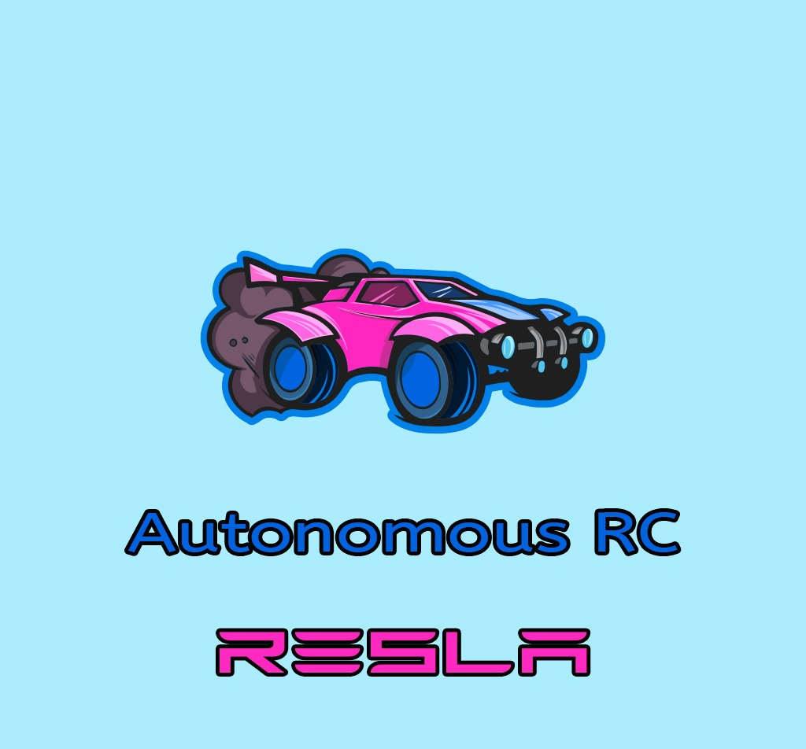

# RESLA
RC car learning project

RESLA is a learning project combining various courses and prior knowledge learned in the first semester of a Machine learning and Data engineering programme in the Lapland University of Applied Sciences (Lapland UAS, Lapin AMK).

Technologies used:

<ul>
  <h3><u>Web stack</u></h3>
  <li>HTML/CSS</li>
  <li>Flask</li>
  <li>MongoDB</li>
  <li>Javascript</li>
   
  <h3><u>Non-web stack</u></h3>
  <li>Raspberry Pi</li>
  <li>Python 3</li>
  <li>ESP32 microcontroller</li>
  <li>C</li>
</ul>

<h2><u>Purpose of the project</u></h2>

To control an RC car wirelessly through a website, and have that website also display data.

